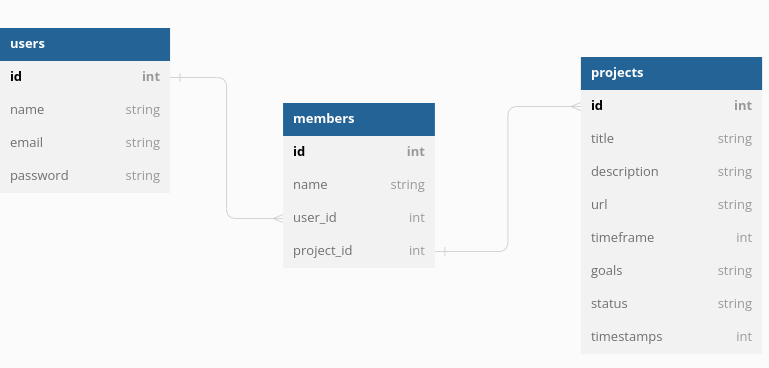

# PROJECT MANAGEMENT APP API

## Project Description
The Project Management App is a web application that allows users to easily manage their projects. 

This full-stack web application uses React for the frontend and a backend API built with sinatra and SQL for data persistence in the database.  

The app allows users to create, read, update, and delete projects Users can also assign tasks to team members and track progress through an intuitive interface.

The server is deployed and is live on;

        https://prt-mngt-backend.onrender.com/

and a path is provided to display the db data.

## Project Setup
### Step One

- Open a terminal / command line interface on your computer
- Clone the repo by using the following:

        git clone [https://github.com/DianaCmaritim/project-management-app-backend.git]

- This will create a copy on your local machine for you.
- Change directory to the repo folder:

        cd project-management-app-backend

- Open it in ``Visual Studio Code`` OR any other code editor of your choice

        code .
### Step Two

- On the top right corner of this page there is a button labelled ``Fork``.
- Click on that button to fork the repo to your own account.
- Then follow  ``Step One`` above.
- Remember to replace your username when cloning.

        git clone https://github.com/your-username-here/project-management-app-backend.git

## Built With
- HTML5 
- ReactJS 
- Ruby Sinatra 
- React 
- SQL 
- Git 
- Render for deploying the server

## Running the application

Use the following steps to run the app.

- Install required dependencies using bundle

      bundle install

- Run the application on the terminal with the following command to open the server;

      rackup

## Domain Model
We have three models: User, Member, and Project.

A user;
* has_many :members 
* has_many :projects, through: :members

A member;
* belongs_to :users
* belongs_to :projects

A project;
* has_many :members
* has_many :users, through: :members

The application allows creating, updating, and deleting(CRUD) objects of the three models, and performing various object relationship methods.

## Entity Relationship Diagram
Here's what our Entity Relationship Diagram looks like:

## Status
The project meets the MVPs but is stilla work in progress to enhance user experience

## Author
This project was contributed to by:
- [Diana Maritim](https://github.com/DianaCmaritim/)

## License
MIT License

Copyright (c) 2023 Year Full name: *Diana Maritim*

Permission is hereby granted, free of charge, to any person obtaining a copy of this software and associated documentation files (the "Software"), to deal in the Software without restriction, including without limitation the rights to use, copy, modify, merge, publish, distribute, sublicense, and/or sell copies of the Software, and to permit persons to whom the Software is furnished to do so, subject to the following conditions:

The above copyright notice and this permission notice shall be included in all copies or substantial portions of the Software.

THE SOFTWARE IS PROVIDED "AS IS", WITHOUT WARRANTY OF ANY KIND, EXPRESS OR IMPLIED, INCLUDING BUT NOT LIMITED TO THE WARRANTIES OF MERCHANTABILITY, FITNESS FOR A PARTICULAR PURPOSE AND NONINFRINGEMENT. IN NO EVENT SHALL THE AUTHORS OR COPYRIGHT HOLDERS BE LIABLE FOR ANY CLAIM, DAMAGES OR OTHER LIABILITY, WHETHER IN AN ACTION OF CONTRACT, TORT OR OTHERWISE, ARISING FROM, OUT OF OR IN CONNECTION WITH THE SOFTWARE OR THE USE OR OTHER DEALINGS IN THE SOFTWARE.

## Front-end URL
 https://github.com/DianaCmaritim/frontend-react-pma/tree/main/pma-frontend